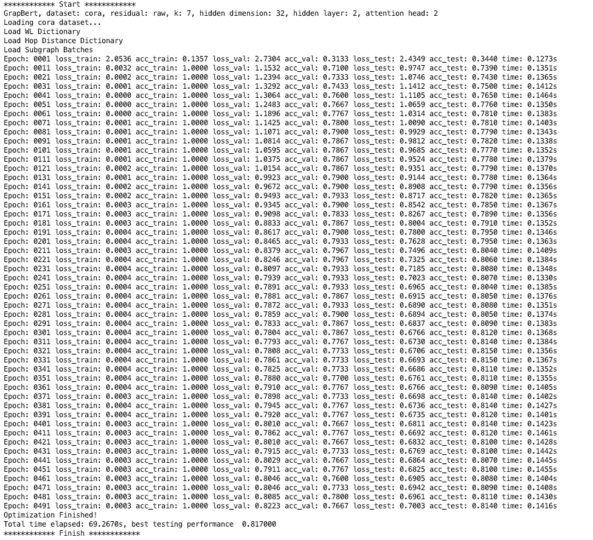

# Graph-Bert

### Source code of "Graph-Bert: Only Attention is Needed for Learning Graph Representations". 

The paper at arXiv is available at https://arxiv.org/abs/2001.05140

At our group homepage, we also have a copy of our latest paper released: http://www.ifmlab.org/files/paper/graph_bert.pdf

###### Two other papers can be helpful for readers to follow the ideas in this paper and the program

(1) SEGEN: Sample-Ensemble Genetic Evolutional Network Model https://arxiv.org/abs/1803.08631

(2) GResNet: Graph Residual Network for Reviving Deep GNNs from Suspended Animation https://arxiv.org/abs/1909.05729

************************************************************************************************

## How to run the code?

(1) The Graph-Bert model takes (a) node WL code, (b) intimacy based subgraph batch, (c) node hop distance as the prior inputs. These can be computed with the script_1_preprocess.py.

(2) Pre-training of Graph-Bert based on node attribute reconstruction and graph structure recovery is provided by script_2_pre_train.py.

(3) Please check the script_3_fine_tuning.py as the entry point to run the model on node classification and graph clustering. 

(4) script_4_evaluation_plots.py is used for plots drawing and results evaluation purposes.

We suggest to run the code with Pycharm.

###### Several toolkits may be needed to run the code
(1) pytorch (https://anaconda.org/pytorch/pytorch)
(2) sklearn (https://anaconda.org/anaconda/scikit-learn) 
(3) transformers (https://anaconda.org/conda-forge/transformers) 
(4) networkx (https://anaconda.org/anaconda/networkx) 

************************************************************************************************

## Organization of the code?

A simpler template of the code is also available at http://www.ifmlab.org/files/template/IFM_Lab_Program_Template_Python3.zip

The whole program is divided into five main parts:
(1) data.py (for data loading and basic data organization operators, defines abstract method load() )
(2) method.py (for complex operations on the data, defines abstract method run() )
(3) result.py (for saving/loading results from files, defines abstract method load() and save() )
(4) evaluate.py (for result evaluation, defines abstract method evaluate() )
(5) setting.py (for experiment settings, defines abstract method load_run_save_evaluate() )

The base class of these five parts are defined in ./code/base_class/, they are all abstract class defining the templates and architecture of the code.

The inherited class are provided in ./code, which inherit from the base classes, implement the abstract methonds.

## Detailed information on funtional classes?

a. data
(1) DatasetLoader.py (for dataset loading)

b. method

b-1 pre-computing methods
(1) MethodWLNodeColoring.py (for WL code computing)
(2) MethodGraphBatching.py (for subgraph batching)
(3) MethodHopDistance.py (for hop distance computing)

b-2 graph-bert basics
(1) MethodBertComp.py (for graph-bert basic components)
(2) MethodGraphBert.py (the graph bert model)

b-3 graph-bert applications
(1) MethodGraphBertNodeClassification.py 
(2) MethodGraphBertGraphClustering.py
(3) MethodGraphBertNodeConstruct.py
(4) MethodGraphBertGraphRecovery.py

c. result
(1) ResultSaving.py (for saving results to file)

d. evaluate
(1) EvaluateAcc.py (accuracy metric)
(2) EvaluateClustering.py (a bunch of clustering metrics)

e. setting
(1) Settings.py (defines the interactions and data exchange among the above classes)

************************************************************************************************

###### Learning results of Graph-Bert with graph-raw residual on Cora dataset.

************************************************************************************************

###### Learning results of Graph-Bert with raw residual on Cora dataset.

************************************************************************************************
